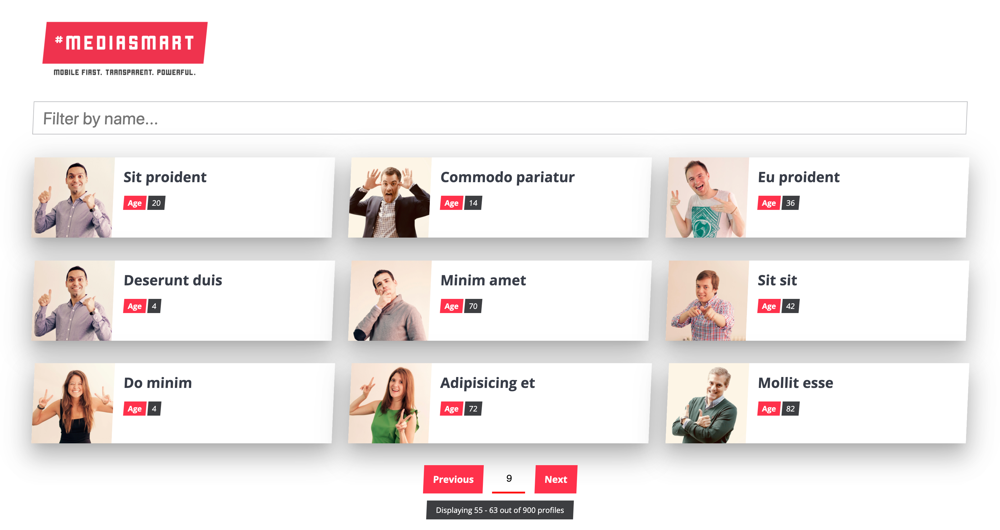

# mediasmart-team
This is a project built for Mediasmart's React/Node.js engineering interview
## Powered by
* [Next.js](https://nextjs.org/)
* [Express.js](https://expressjs.com/)
* [Mongoose](https://mongoosejs.com/)
* [Styled Components](https://github.com/styled-components/styled-components)
* [Isomorphic Unfetch](https://www.npmjs.com/package/isomorphic-unfetch)
## Setting up the project
Run `npm install` to install the required dependencies. Then run `npm run dev` to launch the local server
## Testing environment
This project has been tested on `Mozilla Firefox 66`, `Google Chrome 73` and `Safari 12`
